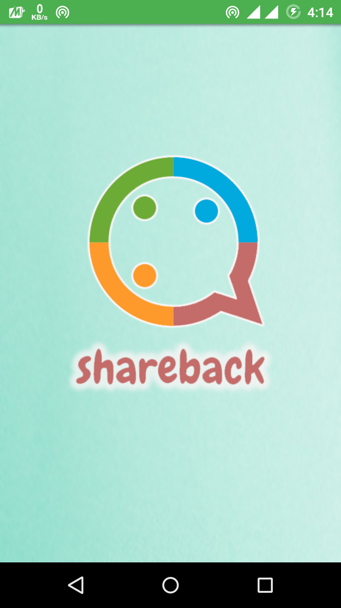
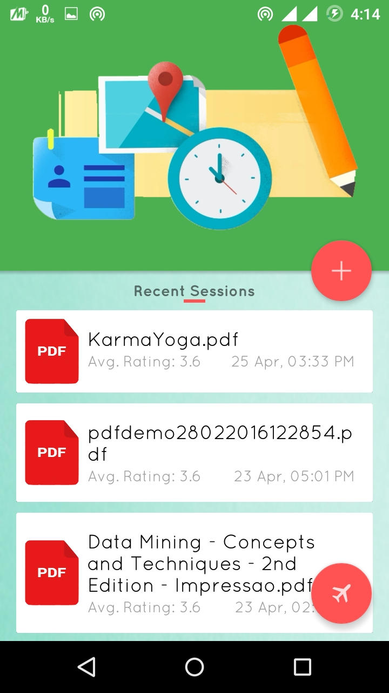
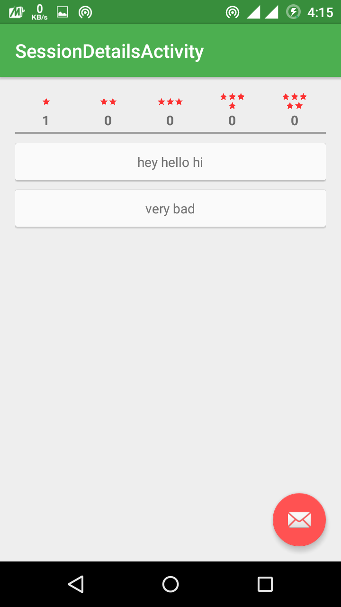
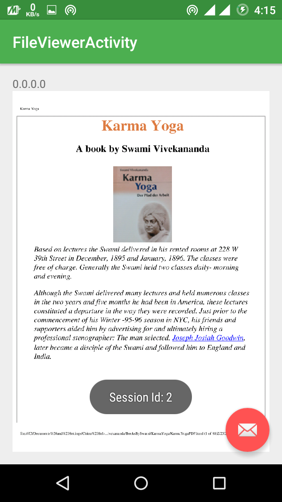

# Share-Back
Virtual Class implementation in Android App. Where students can join session created by instructor and later instructor will hold the control of all connected applications. This App used the concept of real time multicasting of data. 

<h2>Screenshots</h2>

